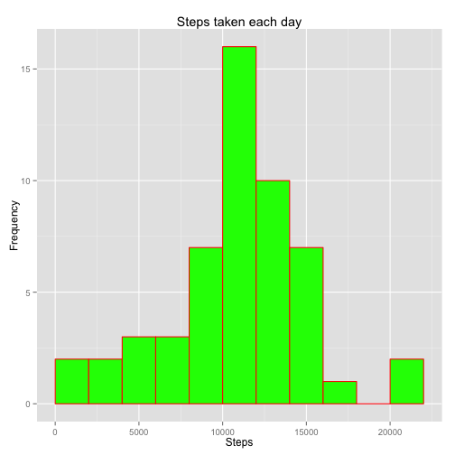
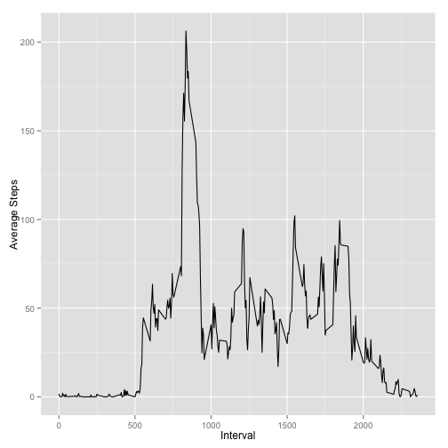
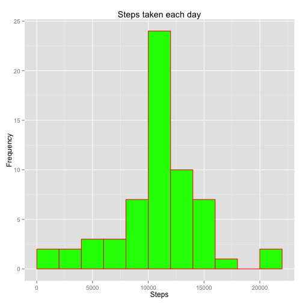
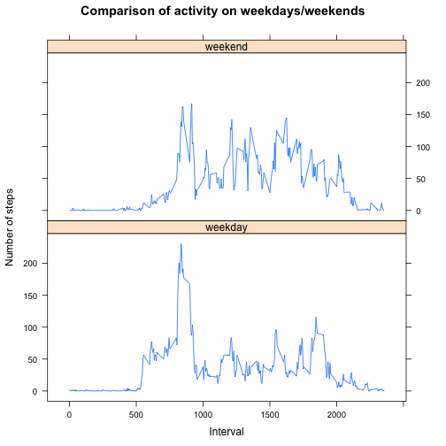

## Prerequisites for processing


```r
library(ggplot2)
library(lattice)
```

## Loading and preprocessing the data


```r
raw_data <- read.csv("activity.csv", sep=",", header=TRUE)
# Aggregate totals
total_data_by_date <- na.omit(aggregate(list(steps=raw_data$steps),list(date = as.Date(raw_data$date)),sum))
```

Let's examine the data to see how the amount of steps varies from day to day


```r
breaks <- pretty(range(total_data_by_date$steps), n = nclass.FD(total_data_by_date$steps), min.n = 1)
bwidth <- breaks[2]-breaks[1]
ggplot(data=total_data_by_date, aes(total_data_by_date$steps)) + 
  geom_histogram(binwidth=bwidth,
    col="red", 
    fill="green") + 
    labs(title="Steps taken each day") +
    labs(x="Steps", y="Frequency") + 
    xlim(c(0,22000)) 
```

 


## What is mean total number of steps taken per day?

The Daily Step Mean: 

```r
mean(total_data_by_date$steps, na.rm = TRUE)
```

```
## [1] 10766.19
```

The Daily Step Median: 


```r
median(total_data_by_date$steps, na.rm = TRUE)
```

```
## [1] 10765
```

## What is the average daily activity pattern?

To answer this question, we need to aggregate the data by steps/interval. 


```r
activity_pattern <- aggregate(
    data=raw_data,
    steps~interval,
    FUN=mean,
    na.action=na.omit
)
colnames(activity_pattern) <- c("Interval", "AverageSteps")
```

This gives us a table of data that begins with the following: 


```
##   Interval AverageSteps
## 1        0    1.7169811
## 2        5    0.3396226
## 3       10    0.1320755
## 4       15    0.1509434
## 5       20    0.0754717
## 6       25    2.0943396
```

Building a time series plot based on that data


```r
ggplot() + 
  geom_line(data = activity_pattern, 
            aes(x = activity_pattern$Interval, y = as.numeric(activity_pattern$AverageSteps))
            ) +
  xlab('Interval') +
  ylab('Average Steps')
```

 

What interval is the most active across the dataset? 


```r
activity_pattern[activity_pattern$AverageSteps==max(activity_pattern$AverageSteps),]
```

```
##     Interval AverageSteps
## 104      835     206.1698
```

As we can see here, the most active interval in the dataset is between 835 and 840. 

## Imputing missing values

This dataset contains NA values which could introduce bias. Let's see how much:


```r
nrow(subset(raw_data, is.na(raw_data$steps)))
```

```
## [1] 2304
```

We need to fill in those missing values. It's important that those missing dates are not dramatically overestimated. In this case we'll use the previous intervals stats. 


```r
step_data <- data.frame(raw_data$steps)
step_data[is.na(step_data),] <- ceiling(tapply(X=raw_data$steps,INDEX=raw_data$interval,FUN=mean,na.rm=TRUE))
deduced_steps <- cbind(step_data, raw_data[,2:3])
colnames(deduced_steps) <- c("Steps", "Date", "Interval")
```

Here's a sample of that new dataset: 


```r
head(deduced_steps)
```

```
##   Steps       Date Interval
## 1     2 2012-10-01        0
## 2     1 2012-10-01        5
## 3     1 2012-10-01       10
## 4     1 2012-10-01       15
## 5     1 2012-10-01       20
## 6     3 2012-10-01       25
```

Now let's see how that data varies from the previous data. Note: this is using the same code with minor column name adjustments as the steps taken each day plot ignoring NA values.


```r
deduced_total_data_date <- na.omit(aggregate(list(steps=deduced_steps$Steps),list(date = as.Date(deduced_steps$Date)),sum))
breaks <- pretty(range(deduced_total_data_date$steps), n = nclass.FD(deduced_total_data_date$steps), min.n = 1)
bwidth <- breaks[2]-breaks[1]
ggplot(data=deduced_total_data_date, aes(deduced_total_data_date$steps)) + 
  geom_histogram(binwidth=bwidth,
    col="red", 
    fill="green") + 
    labs(title="Steps taken each day") +
    labs(x="Steps", y="Frequency") + 
    xlim(c(0,22000)) 
```

 

Daily Step Mean with estimated values: 

```r
mean(deduced_total_data_date$steps)
```

```
## [1] 10784.92
```

Daily Step Median with estimated values: 


```r
median(deduced_total_data_date$steps)
```

```
## [1] 10909
```

As we can see, both the mean/median have increased with our new estimated values.

Mean- 10766.19 (Omitting NA) vs 10784.92 (Estimating NA)
Median - 10765 (Omitting NA) vs 10909 (Estimating NA)

## Are there differences in activity patterns between weekdays and weekends?

To answer this question, we need to know what dates fell on a weekday in 2011.


```r
weekday_data <- data.frame(sapply(X = deduced_steps$Date, FUN = function(daytype) {
    if (weekdays(as.Date(daytype)) %in% c("Saturday","Sunday")) {
        daytype <- "weekend"
    } else {
        daytype <- "weekday"
    }
}))
deduced_data_weekday <- cbind(deduced_steps, weekday_data)
colnames(deduced_data_weekday) <- c("Steps", "Date", "Interval", "Daytype")
```

This data results in a true/false to answer whether it's a weekend or not. 


```r
head(deduced_data_weekday)
```

```
##   Steps       Date Interval Daytype
## 1     2 2012-10-01        0 weekday
## 2     1 2012-10-01        5 weekday
## 3     1 2012-10-01       10 weekday
## 4     1 2012-10-01       15 weekday
## 5     1 2012-10-01       20 weekday
## 6     3 2012-10-01       25 weekday
```

Now we need to average the 5 minute intervals with the day type in place. 


```r
interval_steps <- aggregate(
    data=deduced_data_weekday,
    Steps ~ Daytype + Interval,
    FUN=mean
)
```

Now let's compare the two with lattice. 


```r
xyplot(
    type="l",
    data=interval_steps,
    Steps ~ Interval | Daytype,
    xlab="Interval",
    ylab="Number of steps",
    main="Comparison of activity on weekdays/weekends",
    layout=c(1,2)
)
```

 


